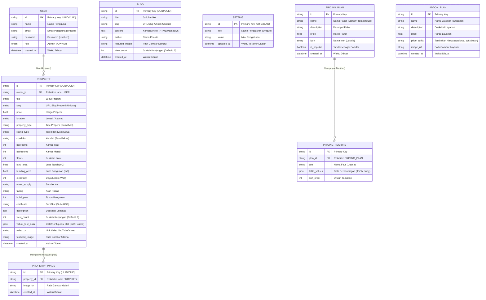

# Skema Database Rumio.id

Dokumen ini menjelaskan struktur relasional database MySQL untuk platform Rumio.id, yang akan dikelola menggunakan **Prisma ORM**.

## 📊 Entity Relationship Diagram (ERD)

Di bawah ini adalah diagram relasi entitas (flowchart database) yang menggambarkan hubungan antar tabel.

---

## 📝 Detail Spesifikasi Tabel (Models)

### 1. Tabel `User`

Menyimpan data admin pengelola platform dan agen/pemilik properti.

- **`id`**: Identifier unik (biasanya menggunakan UUID atau CUID dari Prisma).
- **`name`**: Nama lengkap pengguna.
- **`email`**: Alamat email yang digunakan untuk login (harus unik).
- **`password`**: Kata sandi yang sudah dienkripsi (hashed menggunakan `bcrypt`).
- **`role`**: Peran pengguna. Enum bernilai `ADMIN` (penguasa penuh) atau `OWNER` (pemilik/agen properti tertentu).
- **`created_at`**: Timestamp saat akun dibuat.

### 2. Tabel `Property`

Menyimpan data listing properti yang ditawarkan.

- **`id`**: Identifier unik.
- **`owner_id`**: Foreign key yang terhubung ke `id` di tabel `User`. Menandakan siapa pemilik/agen listing ini.
- **`title`**: Judul penawaran properti (Contoh: "Rumah Mewah Pondok Indah").
- **`slug`**: Versi URL-friendly dari judul (Contoh: `rumah-mewah-pondok-indah`). Harus unik.
- **`price`**: Harga properti (tipe Float atau Decimal).
- **`location`**: Alamat atau lokasi properti.
- **`property_type`**: Tipe properti (Rumah, Apartemen, Ruko, Tanah, dll).
- **`listing_type`**: Tipe iklan (Dijual, Disewakan).
- **`condition`**: Kondisi properti (Baru, Bekas, Indent).
- **`bedrooms`**: Jumlah kamar tidur.
- **`bathrooms`**: Jumlah kamar mandi.
- **`floors`**: Jumlah lantai bangunan.
- **`land_area`**: Luas tanah dalam meter persegi (m²).
- **`building_area`**: Luas bangunan dalam meter persegi (m²).
- **`electricity`**: Daya listrik (misal: 1300, 2200, 3500 Watt).
- **`water_supply`**: Sumber air (misal: PAM, Sumur Bor).
- **`facing`**: Arah hadap bangunan (misal: Utara, Selatan).
- **`build_year`**: Tahun bangunan didirikan atau direnovasi (misal: 2024).
- **`certificate`**: Jenis sertifikat legalitas (misal: SHM, HGB, Strata Title).
- **`description`**: Penjelasan mendetail mengenai properti.
- **`view_count`**: Counter untuk menghitung jumlah pengunjung halaman detail properti. Dimulai dari 0.
- **`virtual_tour_data`**: Data JSON atau path konfigurasi untuk merender Virtual Tour 360 derajat secara self-hosted.
- **`video_url`**: Link untuk menyematkan video presentasi dari YouTube atau Vimeo.
- **`featured_image`**: Path URL untuk gambar sampul/thumbnail properti (Contoh: `/uploads/gambar1.jpg`).
- **`created_at`**: Timestamp properti ditambahkan.

### 3. Tabel `PropertyImage` (Galeri Foto)

Menyimpan banyak foto tambahan untuk satu properti (Galeri Properti).

- **`id`**: Identifier unik.
- **`property_id`**: Foreign key yang terhubung ke `id` di tabel `Property`.
- **`image_url`**: Path URL untuk gambar galeri.
- **`created_at`**: Timestamp foto ditambahkan.

### 4. Tabel `Blog`

Menyimpan data artikel, berita, atau materi edukasi seputar properti.

- **`id`**: Identifier unik.
- **`title`**: Judul artikel blog.
- **`slug`**: URL unik artikel blog.
- **`content`**: Isi artikel (biasanya disimpan dalam format Markdown atau HTML dari Rich Text Editor).
- **`author`**: Nama penulis artikel (bisa string biasa atau berelasi dengan tabel `User` jika diinginkan di masa depan).
- **`featured_image`**: Path URL gambar _cover_ artikel.
- **`view_count`**: Counter untuk menghitung jumlah pengunjung halaman detail artikel blog. Dimulai dari 0.
- **`created_at`**: Timestamp kapan artikel dipublikasikan.

### 5. Tabel `Setting`

Tabel _key-value_ sederhana untuk menyimpan konfigurasi global website agar dapat diubah Admin secara dinamis tanpa mengubah kode.

- **`id`**: Identifier unik.
- **`key`**: Nama variabel konfigurasi. Harus unik. (Contoh: `whatsapp_number`, `company_name`, `dynamic_pricing`).
- **`value`**: Isi dari konfigurasi tersebut (Contoh: `628123456789`).
- **`updated_at`**: Waktu konfigurasi terakhir diubah.

---

## 🔄 Penjelasan Relasi (Relationships)

1.  **One-to-Many (`User` -> `Property`)**
    - Satu **User** (terutama dengan _role_ OWNER) bisa memiliki/mengiklankan **Banyak Property** (0 atau lebih).
    - Setiap **Property** wajib memiliki tepat satu **User** sebagai pemilik/agennya.
2.  **One-to-Many (`Property` -> `PropertyImage`)**
    - Satu **Property** bisa memiliki **Banyak Foto Galeri** (0 atau lebih).
    - Setiap **Foto Galeri** secara eksklusif milik tepat satu **Property**.
3.  **One-to-Many (`PricingPlan` -> `PricingFeature`)**
    - Satu paket harga (**Pricing Plan**) dapat memiliki **Banyak Fitur** (0 atau lebih).
    - Setiap **Fitur** eksklusif milik satu paket harga.

---

### 6. Tabel `PricingPlan` (Paket Harga)

Menyimpan data paket berlangganan atau layanan properti utama yang ada di file `src/data/pricing.ts`.

- **`id`**: Identifier unik (slug seperti `starter`, `pro`, `signature`).
- **`name`**: Nama paket.
- **`description`**: Deskripsi singkat paket.
- **`price`**: Harga paket (bisa disimpan dalam Integer/Float).
- **`icon`**: Nama icon yang digunakan (menyimpan referensi nama lucide-react).
- **`is_popular`**: Boolean untuk menyoroti paket favorit (populer).
- **`created_at`**: Timestamp.

### 7. Tabel `PricingFeature` (Fitur Paket)

Menyimpan daftar fitur dari masing-masing paket.

- **`id`**: Identifier unik.
- **`plan_id`**: Relasi ke `PricingPlan`.
- **`text`**: Nama fitur utama yang akan ditampilkan (Contoh: "Virtual Tour 360° (Premium)").
- **`table_values`**: Data JSON berisi label dan value untuk perbandingan tabel.
- **`sort_order`**: Angka urutan (Integer) untuk menentukan urutan tampilan fitur di layar.

### 8. Tabel `AddonPlan` (Layanan Tambahan)

Menyimpan data layanan ekstra (Addons) yang bisa dibeli pengguna (seperti Foto Drone, Video Cinematic) dari `src/data/pricing.ts`.

- **`id`**: Identifier unik (slug).
- **`name`**: Nama layanan tambahan.
- **`description`**: Deskripsi layanan.
- **`price`**: Harga layanan.
- **`price_suffix`**: Teks akhiran untuk harga (Contoh: `/bulan`).
- **`image_url`**: Path URL untuk gambar penunjang.
- **`created_at`**: Timestamp.
