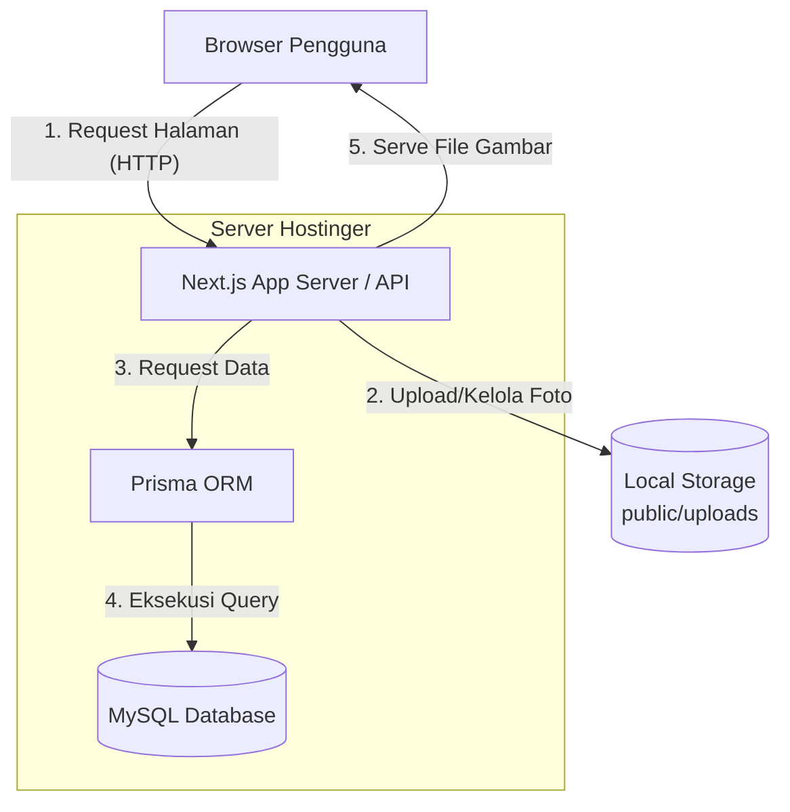
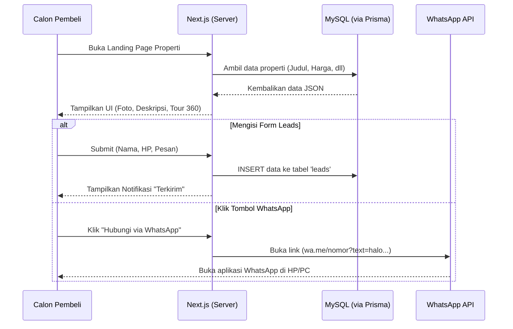
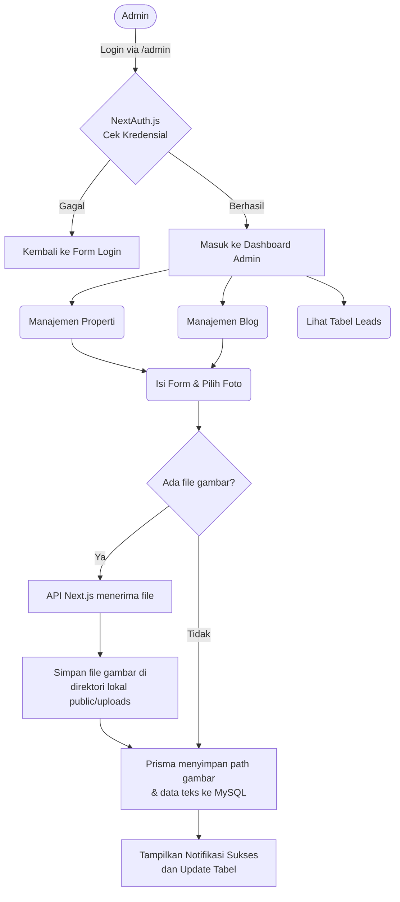

# Flowchart Sistem Rumio.id (Full Hostinger)

Dokumen ini memvisualisasikan alur sistem secara keseluruhan dengan asumsi aplikasi di-_deploy_ **100% pada ekosistem Hostinger** (Aplikasi Next.js berjalan di Node.js Server/VPS Hostinger, dan Database menggunakan MySQL Hostinger).

## 1. Arsitektur Infrastruktur (Hosting & Server)

Menjelaskan bagaimana setiap komponen berjalan dan saling terhubung di dalam server Hostinger yang sama.

---

## 2. Alur Pengunjung (Visitor Flow)

Alur interaksi ketika calon pembeli menelusuri website, melihat properti, hingga memberikan data prospek (Lead) atau mengirim pesan WhatsApp.

---

## 3. Alur CMS Admin & Upload File

Alur bagi Admin untuk masuk ke _dashboard_, membuat daftar properti/blog baru, dan mengunggah gambar yang akan disimpan secara lokal di server Hostinger (`public/uploads`).

